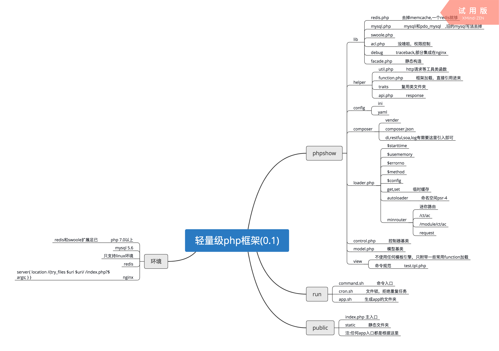

```
      _               _
 _ __ | |__  _ __  ___| |__   _____      __
| '_ \| '_ \| '_ \/ __| '_ \ / _ \ \ /\ / /
| |_) | | | | |_) \__ \ | | | (_) \ V  V /
| .__/|_| |_| .__/|___/_| |_|\___/ \_/\_/
|_|         |_|
```
# phpshow
phpshow,简单易用的php框架,为何要开发这个框架。为了提高自己的编码能力，为了快速解决工作中遇到的难题。
框架更改为composer的加载方式

# 框架介绍
1.  简单的mvc,快速开发而生
2.  版本1.0
# 服务器环境
1.  Nginx + php7以上 + mysql
2.  php扩展seaslog、swoole、redis

## 协议
phpshow 的开源协议为 Apache-2.0，详情参见[LICENSE](LICENSE)

## php配置
### php.ini
1.  short_open_tag = On  ;php短标记打开 <? ?>,模板要使用这样的标记

### nginx配置
``` 
server{
    ...
    if ( !-e $request_filename) {
    	rewrite ^(.*)$ /index.php?s=/$1 last;
    	break;
	}
	location / {
		try_files $uri $uri/ /index.html;
	}
	...
}
```
server中增加$request_file的判断

# 框架教程
### 框架架构




简单的mvc模式，入口在/public文件夹，主要逻辑在于/app文件夹中。

### 路由
<p>路由采用简单的定义方式 $url/{$ct}/{$ac},http://www.baidu.com/index/index,默认ct和ac为index.</p>

### 配置文件  
<p>配置文件主要饮食site(基础配置)database(数据库配置)route_rule(路由规则配置)</p>

### 常用工具函数

dump 打印数据
lookdata 范围的打印
sCookie 设置cookie
gCookie 获取cookie
dCookie 清除cookie

### 核心类的介绍

1. \phpshow\request 获取数据类
2. \phpshow\response 输出类
3. \phpshow\db 数据库驱动
4. \phpshow\psredis redis类
5. \phpshow\http http请求类

### 模型层
继续\model即可调用相关函数

### 模板引擎
使用纯php输出，模板里简单用<? ?> 作为标签

### 简单缓存
使用
<li> 设置缓存 \App::set($key,$value);</li>
<li> 获取缓存 \App::get($key); </li>

## 留言本
联系本人 9448923#qq.com